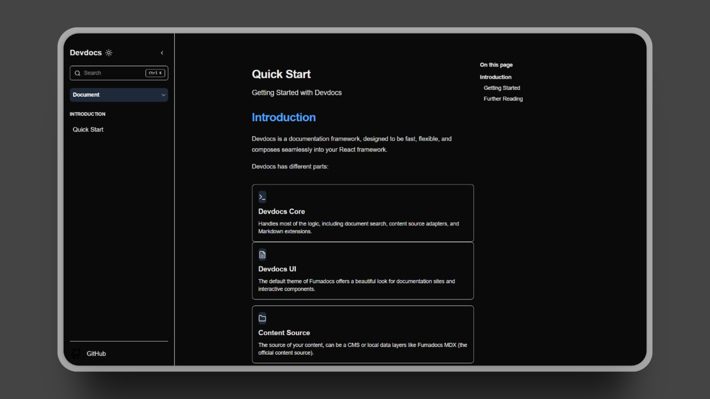

# Devdocs



**Build beautiful, fast, and modern documentation sites with ease.**

Devdocs is an open-source platform that helps you create stunning, feature-rich documentation sites using a powerful and intuitive CLI. It's built on a modern stack including Next.js, Contentlayer, and Tailwind CSS, giving you a first-class developer experience.

## ✨ Key Features

- **🚀 Blazing Fast:** Built on Next.js 14 with the App Router for optimal performance.
- **✍️ MDX-Powered:** Write documentation in Markdown and embed React components seamlessly.
- **🔒 Type-Safe Content:** Leverages Contentlayer to validate your content and provide full type-safety.
- **🎨 Customizable & Accessible UI:** A rich set of pre-built components from the `packages/ui` library. Built with Radix UI and styled with Tailwind CSS, they are fully themeable, accessible, and ready to use in your MDX files.
- **⚙️ Simple CLI:** Get your documentation site up and running in seconds with `devdocs-cli`.
- ** monorepo Ready:** Structured as a Turborepo monorepo for scalability and maintainability.

## 🚀 Getting Started

Get your Devdocs site running in just a few commands:

1.  **Create a new site:**
    ```bash
    npx devdocs-cli create my-awesome-docs
    ```

2.  **Navigate to your new directory:**
    ```bash
    cd my-awesome-docs
    ```

3.  **Install dependencies:**
    ```bash
    pnpm install
    ```

4.  **Start the development server:**
    ```bash
    pnpm dev
    ```

Your new documentation site is now running at `http://localhost:3000`.

## 🏗️ Project Structure

This project is a monorepo managed by Turborepo and pnpm workspaces.

```
/
├── apps/
│   ├── web/  
|   ├── content/docs/
|       ├── introduction
|       ├── UI
|   ├── src/
|       ├── app/
|       ├── components/
|       ├── lib/
|       ├── types
    # Main marketing & documentation site
├── packages/
│   ├── cli/        # Scaffolding CLI (devdocs-cli)
│   ├── core/       # Core logic for content processing
│   └── ui/         # Shared React UI components
└── templates/
    └── next-devdocs/ # Default Next.js starter template
```

## 🎨 UI Components                                                                         

Devdocs includes a comprehensive set of UI components in the `packages/ui` library, designed to make your documentation beautiful and interactive right out of the box.

- **Built for Documentation:** Components like `Card`, `Tabs`, `Callout`, and `CodeBlock` are specifically designed for technical content.
- **Accessible & Themeable:** Built on top of Radix UI for accessibility and styled with Tailwind CSS for easy customization.
- **MDX Ready:** Easily import and use any component directly in your `.mdx` files. 


## Some of the available components include:
  + Accordions  
  + Alerts & Callouts
  + Buttons
  + Cards     
  + Code Blocks with syntax highlighting   
  + Navigation Menus         
  + Tabs   
  + and more... 

## 🤝 Contributing

We welcome contributions from the community! To get started:

1.  Fork the repository.
2.  Clone your fork to your local machine.
3.  Install dependencies using `pnpm install`.
4.  Run the main web app using `pnpm dev`.
5.  Create a new branch for your feature or bug fix.
6.  Make your changes and commit them.
7.  Push your branch and submit a pull request.
